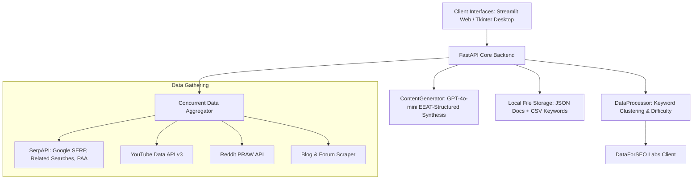

# ✦ E-Commerce Content Studio AI

[](https://huggingface.co/spaces/Soumyadeep-04/content-studio-ai)
[](https://github.com/Somuchamp/Content_proto/actions)
[](https://opensource.org/licenses/MIT)
[](https://www.python.org/)

Automatically generates **highly SEO-optimized, heading-based e-commerce content** for category, brand, and long-form blog pages. It gathers real-time user intent, extracts keywords/FAQs/market signals, and applies AI content synthesis with natural interlinks and strict EEAT alignment.

---

## 🌐 Live Web Portal (100% Free)

You can run the full, cloud-hosted version of the tool instantly without any local setup:

👉 **[Launch Content Studio AI on Hugging Face Spaces](https://huggingface.co/spaces/Soumyadeep-04/content-studio-ai)** 🚀

---

## 🖥️ Standalone Windows Desktop App

We distribute native Windows versions compiled in the cloud via GitHub Actions.

👉 **[Download Standalone Desktop & Setup Wizard (Releases v1.0.2)](https://github.com/Somuchamp/Content_proto/releases)** 📦

### ⚙️ Self-Healing Auto-Updater
The desktop application is engineered with an **integrated background auto-updater**:
* On boot, the app checks the GitHub API for newer cloud releases.
* If a new version is detected, it prompts you with a glowing neon dialog.
* With a single click, it downloads the update and launches a self-deleting batch script (`updater.bat`) that waits, hot-replaces the old executable, and automatically restarts the updated app!

---

## ⚙️ Core Architecture Flow



---

## 🚀 Key Features

### 📡 1. Concurrent Market Scrape Aggregation
* **Threaded Scraper Engine**: Leverages a high-performance `ThreadPoolExecutor` to scrape multiple channels in parallel, drastically reducing user wait-times.
* **Google SERP Mining**: Extracts top ranking organic sites, **People Also Ask (PAA)** questions, and **Related Searches / People Also Search For** chips.
* **SERP Rich Feature Parser**:
  * **Popular Products Grids**: Gathers immersive Google Shopping cards containing thumbnails, titles, sources, ratings, and pricing.
  * **Inline Videos**: Collects duration, channel name, video title, and link metadata from organic search videos.
  * **Google AI Overviews**: Extracts the direct Google AI text block summaries along with their referenced source links.
* **YouTube Signals Scraper**: Collects top-ranking video titles, descriptions, and channel URLs matching your keywords to understand visual media traction.
* **Reddit PRAW Scraper**: Crawls relevant tech/topic subreddits to analyze hot consumer threads, popular comments, and direct buyer pain-points.
* **Forum Crawler**: Employs `BeautifulSoup` and `cloudscraper` (to bypass Cloudflare restrictions) to gather community forum discussions on Quora and Medium.

### 🧠 2. DataForSEO Analytics Integration
* **Advanced Keyword Research**: Retrieves live Search Volume, Cost-Per-Click (CPC), Competition levels, and SEO difficulty scores for targeted words.
* **Long-Tail Keyword Expansion**:
  * **Google Live Autocomplete**: Gathers long-tail expansion chips from direct Google autocomplete query feeds.
  * **Related Keywords ("Also Rank For")**: Pulls keywords that similar top-performing competitors are actively ranking for.
* **Competitor Analytics Batch**: Runs batch evaluations on competing domains to retrieve ETV (Estimated Traffic Value), organic keywords footprint, and domain authority.
* **LLM Mentions Tracker**: Scans AI search engines (ChatGPT, etc.) to analyze direct brand citations, platform answers, and search volumes.
* **On-Page Site Audit Crawler**: Boots asynchronous page crawlers to calculate domain health scores, reporting broken links/resources, duplicate content, missing tags, or redirect loops.

### ✍️ 3. Strategic AI Content Synthesizer
* **GPT-4o-Mini Orchestration**: Harnesses OpenAI's optimized language models with custom-tailored strategic prompt layouts.
* **Automatic JSON Sanitizer**: Custom regex-based escape interceptor that automatically sanitizes unescaped newlines/tabs inside generated JSON structures to prevent parsing failures.
* **Three Dedicated Generation Strategies**:
  * **📂 Category Page Mode**: Optimizes structural category hierarchies, user buying guides, and keyword density mapping.
  * **🏷️ Brand Page Mode**: Focuses on brand highlighting, product catalog ratings, and key comparative advantages.
  * **📝 Blog / Keyword Mode**: Generates long-form, highly readable blog posts featuring proper hooks, informational headers, and natural interlinking.
* **Cross-Border Ubuy Integration**: Embeds natural, editorial product references and marketplace shipping integrations specific to the target country (EEAT compliant).
* **Defensive Key Stripper**: Automatically sanitizes trailing newlines (`\n`, `\r`) and whitespaces from API secrets in `Settings` to completely prevent `Illegal Header` or `Bad Request` crashes.

### 🖥️ 4. Premium Windows Desktop Client
* **Obsidian Space Theme**: A gorgeous dark UI accented with glowing neon-cyan components.
* **Custom TK Components**: Embedded custom `CanvasEntry` boxes with active glowing borders, `CanvasDropdown` fields with real-time text filter searches, and concentric `CanvasSlider` scales with active neon halos.
* **Vault & Research Portals**: Interactive multi-tab panel separating your local **Strategy Vault** (collapsible report sections, quick-copy clipboards) from the live **Research Hub** (keyword tables, competitor batch checkers, and settings).
* **Self-Healing Update System**: Employs background threads to poll your GitHub Releases API, presenting download prompts for new versions, and running local `updater.bat` batch files to overwrite and relaunch the application seamlessly.

### 📁 5. Centralized Data Storage & Scheduler
* **AppData Caching**: Resolves standard Windows `Program Files` permission locks by storing database JSON reports and CSV keyword lists in the user's `%LocalAppData%/ContentStudioAI/` folder.
* **APScheduler Automation**: Boots background thread executors inside the FastAPI application, running daily, weekly, monthly, or customized hourly content updates.

---

## 🛠️ Local Setup & Installation

If you prefer to run the application locally on your machine, follow these instructions:

### 1. Prerequisites
Ensure you have **Python 3.11** installed on your system.

### 2. Install Dependencies
```bash
# Clone the repository
git clone https://github.com/Somuchamp/Content_proto.git
cd Content_proto

# Create and activate a virtual environment
python -m venv .venv
source .venv/bin/activate  # On Windows, use: .venv\Scripts\activate

# Install required packages
pip install -r requirements.txt
```

### 3. Configure API Credentials
Create a `.env` file in the root directory (based on the template below) and add your private API keys:
```env
# === API KEYS ===
YOUTUBE_API_KEY=your_youtube_key
SERP_API_KEY=your_serpapi_key
REDDIT_CLIENT_ID=your_reddit_id
REDDIT_CLIENT_SECRET=your_reddit_secret
REDDIT_USER_AGENT=ecom-content-tool/1.0
DATAFORSEO_API_KEY=your_dataforseo_base64_auth
OPENAI_API_KEY=your_openai_key
```

### 4. Running the Portals Locally

* **Run the FastAPI + Streamlit Web Portal**:
  ```bash
  # FastAPI Backend (Runs on Port 8800)
  uvicorn app.main:app --reload --port 8800
  
  # Streamlit Frontend (Runs on Port 8501)
  streamlit run streamlit_app.py
  ```

* **Run the Desktop Tkinter Application**:
  ```bash
  python gui_app.py
  ```

* **Compile Standalone Desktop Executable**:
  ```bash
  python build_exe.py
  ```

---

## 🔒 Security Best Practices
* **Secrets Isolation**: API keys must **never** be hardcoded in python source code.
* **Git Exclusions**: The local `.env` configuration file, virtual environments (`.venv/`), compiled cache (`__pycache__/`), and build folders (`build/`, `dist/`) are strictly ignored via `.gitignore` and `.dockerignore` to prevent any credentials leak.
