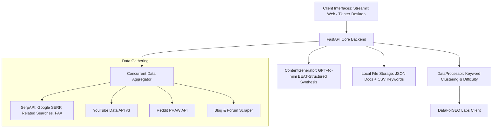

# ✦ E-Commerce Content Studio AI

[](https://huggingface.co/spaces/Soumyadeep-04/content-studio-ai)
[](https://github.com/Somuchamp/Content_proto/actions)
[](https://opensource.org/licenses/MIT)
[](https://www.python.org/)

Automatically generates **highly SEO-optimized, heading-based e-commerce content** for category, brand, and long-form blog pages. It gathers real-time user intent, extracts keywords/FAQs/market signals, and applies AI content synthesis with natural interlinks and strict EEAT alignment.

---

## 🌐 Live Web Portal (100% Free)

You can run the full, cloud-hosted version of the tool instantly without any local setup:

👉 **[Launch Content Studio AI on Hugging Face Spaces](https://huggingface.co/spaces/Soumyadeep-04/content-studio-ai)** 🚀

---

## 🖥️ Standalone Windows Desktop App

We distribute native Windows versions compiled in the cloud via GitHub Actions.

👉 **[Download Standalone Desktop & Setup Wizard (Releases v1.0.2)](https://github.com/Somuchamp/Content_proto/releases)** 📦

### ⚙️ Self-Healing Auto-Updater
The desktop application is engineered with an **integrated background auto-updater**:
* On boot, the app checks the GitHub API for newer cloud releases.
* If a new version is detected, it prompts you with a glowing neon dialog.
* With a single click, it downloads the update and launches a self-deleting batch script (`updater.bat`) that waits, hot-replaces the old executable, and automatically restarts the updated app!

---

## ⚙️ Core Architecture Flow



---

## 🚀 Key Features

* **Multi-Platform Scrape Aggregation**: Concurrent threaded scraping of YouTube, Google SERP, Reddit, and forums to aggregate consumer intents.
* **Deep SEO Analytics (DataForSEO)**: In-depth keyword research, search suggestions, also-rank-for metrics, competitor footprint, and automated site audit crawlers.
* **Strategic Content Generation**:
  * **📂 Category Page Mode**: Highly optimized for category navigation and product list SEO.
  * **🏷️ Brand Page Mode**: Structured brand highlights and product feature analysis.
  * **📝 Blog/Keyword Mode**: Comprehensive educational articles with organic Ubuy cross-border marketplace interlinking.
* **Centralized Data Storage**: Reads and writes directly to optimized JSON reports and CSV keyword lists in the system's `Local AppData` directory to resolve Windows permission constraints.
* **Automated Background Refresh**: Uses `APScheduler` to run daily, weekly, monthly, or customized hourly content update loops.

---

## 🛠️ Local Setup & Installation

If you prefer to run the application locally on your machine, follow these instructions:

### 1. Prerequisites
Ensure you have **Python 3.11** installed on your system.

### 2. Install Dependencies
```bash
# Clone the repository
git clone https://github.com/Somuchamp/Content_proto.git
cd Content_proto

# Create and activate a virtual environment
python -m venv .venv
source .venv/bin/activate  # On Windows, use: .venv\Scripts\activate

# Install required packages
pip install -r requirements.txt
```

### 3. Configure API Credentials
Create a `.env` file in the root directory (based on the template below) and add your private API keys:
```env
# === API KEYS ===
YOUTUBE_API_KEY=your_youtube_key
SERP_API_KEY=your_serpapi_key
REDDIT_CLIENT_ID=your_reddit_id
REDDIT_CLIENT_SECRET=your_reddit_secret
REDDIT_USER_AGENT=ecom-content-tool/1.0
DATAFORSEO_API_KEY=your_dataforseo_base64_auth
OPENAI_API_KEY=your_openai_key
```

### 4. Running the Portals Locally

* **Run the FastAPI + Streamlit Web Portal**:
  ```bash
  # FastAPI Backend (Runs on Port 8800)
  uvicorn app.main:app --reload --port 8800
  
  # Streamlit Frontend (Runs on Port 8501)
  streamlit run streamlit_app.py
  ```

* **Run the Desktop Tkinter Application**:
  ```bash
  python gui_app.py
  ```

* **Compile Standalone Desktop Executable**:
  ```bash
  python build_exe.py
  ```

---

## 🔒 Security Best Practices
* **Secrets Isolation**: API keys must **never** be hardcoded in python source code.
* **Git Exclusions**: The local `.env` configuration file, virtual environments (`.venv/`), compiled cache (`__pycache__/`), and build folders (`build/`, `dist/`) are strictly ignored via `.gitignore` and `.dockerignore` to prevent any credentials leak.